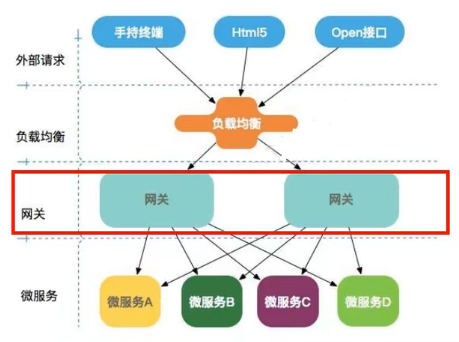
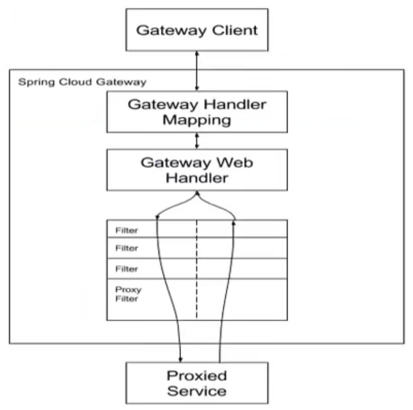
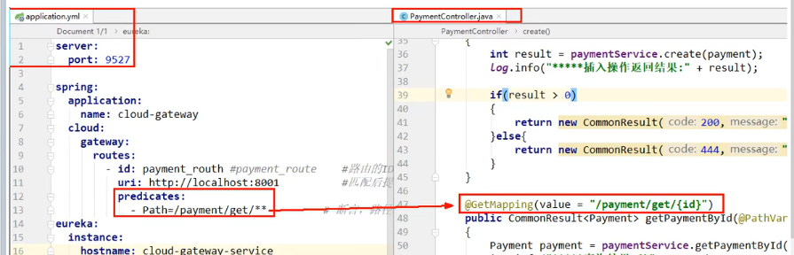
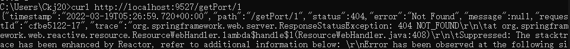
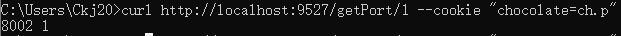
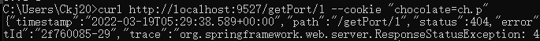
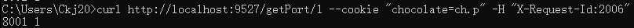

## GateWay

基于WebFlux框架实现的，而WebFlux框架底层则使用高性能的Reactor模式通信框架Netty



非阻塞异步模型

三大组件：
- Route路由
  路由时构建网关的基本模块，它由ID，目标URI(统一资源标志符,URL是URI的一个子集)，一系列的断言和过滤器组成，如果断言为true则匹配该路由
- Predicate断言
  开发人员可以匹配HTTP请求中的所有内容，例如请求头或请求参数，如果请求参数与断言相匹配则进行路由
- Filter过滤
  指的是Spring框架中GatewayFilter的实例，使用过滤器，可以在请求被路由前或者之后对请求进行修改

工作流程：

客户端向Spring Cloud Gateway发出请求。然后在Gateway Handler Mapping 中找到与请求相匹配的路由，将其发送到GatewayWeb Handler
Handler再通过指定的过滤器链来将请求发送到我们实际的服务执行业务逻辑，然后返回
过滤器之间用虚线分开是因为过滤器可能会在发送代理请求之前(“pre”)或之后(“post”)执行业务逻辑
Filter在“pre”类型的过滤器可以做参数校验、权限校验、流量监控、日志输出、协议转换等
在“post”类型的过滤器中可以做响应内容、响应头的修改，日志的输出，流量监控等有着非常重要的作用

## 使用步骤

依赖
```xml
<dependency>
    <groupId>org.springframework.cloud</groupId>
    <artifactId>spring-cloud-starter-gateway</artifactId>
</dependency>
```
注意：使用gateway时，不能导入`spring-boot-starter-web`和`spring-boot-starter-actuator`

配置routes，两种方法，推荐用配置文件：
```yml
server:
  port: 9527

spring:
  application:
    name: cloud-gateway
  cloud:
    nacos:
      discovery:
        server-addr: localhost:8848 #Nacos服务注册中心地址
    gateway:
      routes:
        - id: payment_routh1
          uri: http://localhost:8001
          predicates:
            - Path=/getPort/**

        - id: payment_routh2
          uri: http://localhost:8001
          predicates:
            - Path=/payment/get/**
```



## predicates常用配置
每个配置之间的关系为`AND`

- After
  在什么时间之后
  `- After=2017-01-20T17:42:47.789-07:00[Asia/Shanghai]`
  可通过程序获取当前时间
  ```java
  import org.junit.jupiter.api.Test;
  import java.time.ZonedDateTime;

  public class T2 {

      @Test
      public void ttt(){
          ZonedDateTime zbj = ZonedDateTime.now();
          System.out.println(zbj);
      }
  }
  // 2022-03-19T12:13:59.014+08:00[Asia/Shanghai]
  ```
- Before
  类似After
  `- Before=2017-01-20T17:42:47.789-07:00[Asia/Shanghai]`
- Between
  类似After和Before
  `- Between=2017-01-20T17:42:47.789-07:00[Asia/Shanghai],2022-03-19T12:13:59.014+08:00[Asia/Shanghai]`
- Cookie
  需要两个参数，kv键值对，每对之间用`;`分割
  `- Cookie=chocolate, ch.p`
  
  
- Header
  http请求头
  `- Header=X-Request-Id, \d+ # 请求头要又X-Request-Id属性并且值为整数的正则表达式`
  
  
- Host
  限制域名
  `- Host=**.ckjserver.com`
  `curl http://localhost:9527/getPort/1 --cookie "chocolate=ch.p" -H "Host: www.ckjserver.com"`
- Method
  `- Method=GET`
- Path
- Query
  要求有参数值username，并且值还要是整数才行
  `- Query=username, \d+`
- RemoteAddr
  `- RemoteAddr=192.168.1.1/24`

## Filter

在请求被路由前或着之后对请求进行拦截

仅需实现两个接口`GlobalFilter, Ordered`

实现两个方法`filter、getOrder`
- filter
  exchange中有传来的所有信息
  chain
- getOrder
  加载过滤器的顺序，数字越小优先级越高

```java
package com.ckj.filter;

import lombok.extern.slf4j.Slf4j;
import org.apache.http.HttpStatus;
import org.springframework.cloud.gateway.filter.GatewayFilterChain;
import org.springframework.cloud.gateway.filter.GlobalFilter;
import org.springframework.core.Ordered;
import org.springframework.stereotype.Component;
import org.springframework.web.server.ServerWebExchange;
import reactor.core.publisher.Mono;

@Component
@Slf4j
public class MyGateWayFilter implements GlobalFilter, Ordered {
    @Override
    public Mono<Void> filter(ServerWebExchange exchange, GatewayFilterChain chain) {
        log.info("*****MyGateWayFilter start*****");

        String uname = exchange.getRequest().getQueryParams().getFirst("uname");
        if (uname == null){
            log.info("非法用户，filter");
            exchange.getResponse().setRawStatusCode(HttpStatus.SC_NOT_ACCEPTABLE);
            return exchange.getResponse().setComplete();
        }

        log.info("*****MyGateWayFilter end*****");
        return chain.filter(exchange);
    }


    // 加载过滤器的顺序，数字越小，优先级越高
    @Override
    public int getOrder() {
        return 0;
    }
}
```