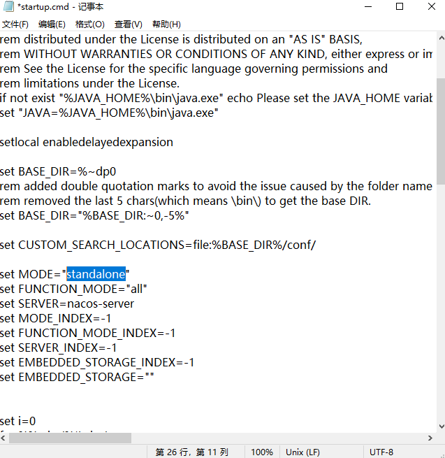

# Nacos

Nacos是用于构建云本机应用程序的易于使用的动态服务发现，配置和服务管理平台

## 安装nacos

https://github.com/alibaba/nacos/releases

下载`nacos-server-x.x.x.zip`，解压


windows下startup.cmd是启动入口

在启动nacos前需要对nacos进行处理，nacos启动脚本(startup.cmd)默认启动模式为集群模式(set MODE=“cluster”)，但由于我们是单机运行，就需要将`set MODE=“cluster”`改成`set MODE=“standalone”`(或者不修改配置，在每次运行时使用命令：`startup -m standalone`，需进入`startup.cmd`所在目录或将该目录加入环境变量)
右键`startup.cmd`，点击编辑,将`set MODE=“cluster”`改成`set MODE=“standalone”`




启动后，在浏览器中打开：http://localhost:8848/nacos，会提示输入用户名密码，用户名密码初始值都为`nacos`，登陆后得到


## nacos服务注册

- 添加依赖

  ```xml
  <dependency>
      <groupId>com.alibaba.cloud</groupId>
      <artifactId>spring-cloud-starter-alibaba-nacos-discovery</artifactId>
  </dependency>
  ```

- 子模块启动类添加注释`@EnableDiscoveryClient`

  ```java
  package com.ckj;

  import org.springframework.boot.SpringApplication;
  import org.springframework.boot.autoconfigure.SpringBootApplication;
  import org.springframework.cloud.client.discovery.EnableDiscoveryClient;

  @SpringBootApplication
  @EnableDiscoveryClient
  public class api8001 {
      public static void main(String[] args) {
          SpringApplication.run(api8001.class,args);
      }
  }
  ```

- 修改配置文件
  `application.yml`
  ```yml
  server:
    port: 8001
  spring:
    application:
      name: demo-server
    cloud:
      nacos:
        discovery:
          server-addr: localhost:8848 #Nacos服务注册中心地址
  ```

注意，运行子模块前，需要运行`nacos`

用浏览器登录`nacos`，在[服务管理]-[服务列表]中可查看子模块的服务信息


### nacos继承ribbon实现负载均衡

在版本的nacos中没有继承ribbon，此时需要自行添加loadbalancer

```xml
<dependency>
    <groupId>org.springframework.cloud</groupId>
    <artifactId>spring-cloud-starter-loadbalancer</artifactId>
    <scope>compile</scope>
</dependency>
```

启动两个全部相同(尤其是spring.application.name相同)但端口不同的服务，注册进nacos，本文：provider-payment

provider的controller
```java
package com.ckj.controller;

import com.ckj.service.PaymentService;
import lombok.extern.slf4j.Slf4j;
import org.springframework.beans.factory.annotation.Autowired;
import org.springframework.beans.factory.annotation.Value;
import org.springframework.web.bind.annotation.*;

@RestController
@Slf4j
public class PaymentController {
    @Autowired
    private PaymentService paymentService;

    @Value("${server.port}") // 此处一个provider是8001，一个是8002，在配置文件中编写
    private String serviceUrl;

    @GetMapping(value = "/getPort/{id}")
    public String getPort(@PathVariable("id") Long id) {
        return serviceUrl + " " + id;
    }
}

```


编写消费者服务


Consumer83
```java
package com.ckj;

import org.springframework.boot.SpringApplication;
import org.springframework.boot.autoconfigure.SpringBootApplication;
import org.springframework.cloud.client.discovery.EnableDiscoveryClient;

@SpringBootApplication
@EnableDiscoveryClient
public class Consumer83 {

    public static void main(String[] args) {
        SpringApplication.run(Consumer83.class,args);
    }
}
```

CommonResult
```java
package com.ckj.entities;

public class CommonResult<T> {
    private Integer code;
    private String message;
    private T data;

    //get && set && toString && Contruction
}
```

```java
package com.ckj.controller;

import lombok.extern.slf4j.Slf4j;
import org.springframework.beans.factory.annotation.Value;
import org.springframework.web.bind.annotation.GetMapping;
import org.springframework.web.bind.annotation.PathVariable;
import org.springframework.web.bind.annotation.RestController;
import org.springframework.web.client.RestTemplate;

import javax.annotation.Resource;

@RestController
@Slf4j
public class OrderNacosController {
    @Value("${service-url.nacos-user-service}")
    private String serviceUrl;

    @Resource
    private RestTemplate restTemplate;

    @GetMapping(value = "/consumer/getPaymentPort/{id}")
    public String getPaymentPort(@PathVariable("id") Long id){
        return restTemplate.getForObject(serviceUrl+"/getPort/"+id,String.class);
    }
}

```

ApplicationContextConfig
```java
package com.ckj.config;


import org.springframework.cloud.client.loadbalancer.LoadBalanced;
import org.springframework.context.annotation.Bean;
import org.springframework.context.annotation.Configuration;
import org.springframework.web.client.RestTemplate;

@Configuration
public class ApplicationContextConfig {
    @Bean
    @LoadBalanced
    public RestTemplate restTemplate(){
        return new RestTemplate();
    }
}
```

application.yml
```yml
server:
  port: 83
spring:
  application:
    name: grid-server-consumer
  cloud:
    nacos:
      discovery:
        server-addr: localhost:8848 #Nacos服务注册中心地址

service-url:
  nacos-user-service: http://provider-payment
```

核心：
- consumer中的application.yml，nacos-user-service后要跟着provider的服务名，也就是nacos中显示的服务名
  

- consumer中的OrderNacosController，getPaymentPort中的`return restTemplate.getForObject(serviceUrl+"/getPort/"+id,String.class);`要指向provider的controller方法，其serviceUrl是选择了对应服务名中的一个服务

- 在restTemplate上一定要加上`@LoadBalanced`

### nacos配置中心

```xml
<dependency>
    <groupId>com.alibaba.cloud</groupId>
    <artifactId>spring-cloud-starter-alibaba-nacos-discovery</artifactId>
</dependency>

<dependency>
    <groupId>com.alibaba.cloud</groupId>
    <artifactId>spring-cloud-starter-alibaba-nacos-config</artifactId>
</dependency>
```

注意使用高版本的nacos-config时，需要添加`spring-cloud-starter-bootstrap`
```xml
<dependency>
    <groupId>org.springframework.cloud</groupId>
    <artifactId>spring-cloud-starter-bootstrap</artifactId>
    <version>x.x.x</version>
</dependency>
```

启动nacos

在`resources`下添加`bootstrap.yml`，在将`spring.cloud.nacos`的配置移至`bootstrap.yml`中，添加`spring.cloud.nacos.config.server-addr && spring.cloud.nacos.config.file-extension`，如下`bootstrap.yml`：
```yml
spring:
  cloud:
    nacos:
      discovery:
        server-addr: localhost:8848 # Nacos服务注册中心地址
      config:
        server-addr: localhost:8848 # nacos配置中心的地址
        file-extension: yaml
```
`application.yml`：
```yml
spring:
  profiles:
    active: dev
  application:
    name: nacos-config-client
server:
  port: 3377
```

创建测试`controller`，该测试类中的`${config.info}`，表示从配置文件中取出`config.info`这条配置，如果通过nacos配置中心配置的文件中的信息被提取出来了，就代表成功配置
```java
package com.ckj.controller;

import org.springframework.beans.factory.annotation.Value;
import org.springframework.cloud.context.config.annotation.RefreshScope;
import org.springframework.web.bind.annotation.GetMapping;
import org.springframework.web.bind.annotation.RestController;

@RestController
@RefreshScope
public class ConfigClientController {

    @Value("${config.info}")
    private String configInfo;

    @GetMapping("/config/info")
    public String getConfigInfo(){
        return configInfo;
    }
}
```

在nacos的[配置管理]-[配置列表]中添加配置

需要注意的是：`Data ID`有专门的要求，`${spring.application.name}-${spring.profile.active}.${spring.cloud.nacos.config.file-extension}`
本文中也就是`nacos-config-client-dev.yaml`，并且该yaml不能写成yml


配置文成后，开启服务，就能通过接口访问到`config.info`

# nacos-config-client-dev.yaml

### nacos 启动MySQL为数据源

打开`conf\nacos-mysql.sql`，执行代码，建立数据库

打开`application.properties`，文末添加，注意修改数据库名、用户名、密码
```properties
spring.datasource.platform=mysql

db.num=1
db.url.0=jdbc:mysql://127.0.0.1:3306/nacos_config?characterEncoding=utf8&connectTimeout=1000&socketTimeout=3000&autoReconnect=true&useUnicode=true&useSSL=false&serverTimezone=UTC
db.user=root
db.password=ckj
```

官网写要加上下列信息，但缺少了个时区信息，导致数据库连接不了，应该向上文那样编写
```properties
spring.datasource.platform=mysql

db.num=1
db.url.0=jdbc:mysql://11.162.196.16:3306/nacos_devtest?characterEncoding=utf8&connectTimeout=1000&socketTimeout=3000&autoReconnect=true
db.user=nacos_devtest
db.password=youdontknow
```

### nacos 搭建集群(linux)

进入nacos目录，复制conf/cluster,conf.example一份，复制为cluster.conf，编辑，将内容设置为自己设定的服务器ip以及端口号，不能用127.0.0.1，需要通过ip addr查询本机ip

编辑bin/startup.sh

在此处添加对应内容
`p:` `p)`+`换行`+`PORT=$OPTARG;;`


移到文件最后，在`$JAVA`后面添加`-Dserver.port=${PORT}`


保存退出

此后，就能通过加参数`-p`来限制启动端口：`startup -p 3333`


### nacos 集成nginx

进入nginx的conf目录


`vim nignx.conf`

- 添加集群upsteam 集群名{server ip:端口}
- 修改server的监听端口server
- 修改location，proxy_pass通过http://集群名
  

测试通过nginx访问nacos，注意端口号为server中监听的端口号，[测试访问](http://nginx主机ip:端口号/nacos/login)