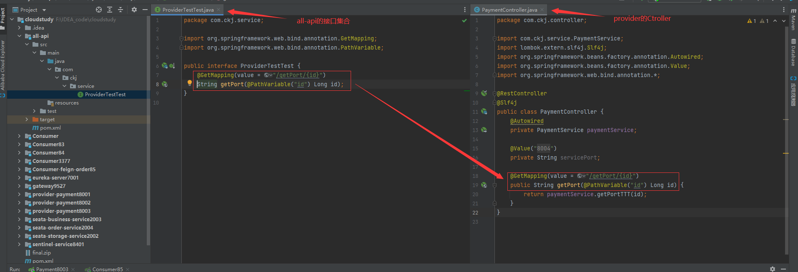
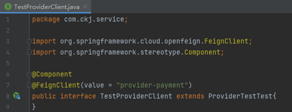
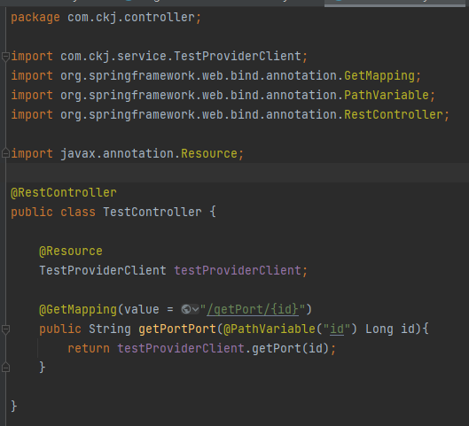

## OpenFeign

[github-openfeign官网](https://github.com/spring-cloud/spring-cloud-openfeign)

OpenFeign在Feign的基础上增加了一些东西，而且Feign目前已经停止维护了，Feign继承了Ribbon，实现客户端的负载均衡

Ribbon 是采用 Ribbon + RestTemplate 来对http请求及进行封装处理，形成了一套模板化的调用方式
但在实际开发中，对服务依赖的调用可能不止一处，往往一个接口会被多处调用，所以通常都会针对每个微服务自行封装一些客户端类来帮装这些以来服务的调用
Feign在此基础上做了进一步的封装，由他来帮助我们定义和实现以来服务接口的定义
在Feign的实现下，只需要创建一个接口并使用注解的方式来配置它

依赖：
```xml
<dependency>
    <groupId>org.springframework.cloud</groupId>
    <artifactId>spring-cloud-starter-openfeign</artifactId>
</dependency>
```

注解：
`@FeignClient`
`@EnableFeignClients`

## 使用步骤

- 在启动类中加入注解`@EnableFeignClients`
  表明启动`feign`注解扫描

- 编写`feignService`，添加注解`@FeignClient(value = "")`
  其中存储了需要通过feign负载均衡的接口，注意是`Service`，要`interface`文件格式
  value的值为调用的服务名称
  ```java
  package com.ckj.service;

  import org.springframework.cloud.openfeign.FeignClient;
  import org.springframework.stereotype.Component;
  import org.springframework.web.bind.annotation.GetMapping;
  import org.springframework.web.bind.annotation.PathVariable;

  @Component
  @FeignClient(value = "provider-payment") // 调用的微服务名称
  public interface PaymentFeignService {
      @GetMapping(value = "/getPort/{id}")
      public String getPort(@PathVariable("id") Long id);
  }
  ```
  上例接口调用服务名为`provider-payment`的服务
  在其中添加`provider-payment`服务具备的接口，带上`@GetMapping`等注解，也就是复制对应服务中需要负载均衡的`controller`
  `@FeignClient`注解会自动将该类注册至spring bean中，供自动装配

- 编写消费者controller
  在消费者controller中新建接口类，并自动装配
  ```java
  @Resource
  private PaymentFeignService paymentFeignService;
  ```

  在具体controller中调用该实例
  `paymentFeignService.getPort(1L);`
  ```java
  @GetMapping(value = "/consumer/getPaymentPort/{id}")
  public String getPaymentById(@PathVariable("id") Long id){
      return paymentFeignService.getPort(1L);
  }
  ```

  ```java
  package com.ckj.controller;

  import com.ckj.service.PaymentFeignService;
  import lombok.extern.slf4j.Slf4j;
  import org.springframework.web.bind.annotation.GetMapping;
  import org.springframework.web.bind.annotation.PathVariable;
  import org.springframework.web.bind.annotation.RestController;

  import javax.annotation.Resource;

  @RestController
  @Slf4j
  public class FeignOrderNacosControllegr {
      @Resource
      private PaymentFeignService paymentFeignService;

      @GetMapping(value = "/consumer/getPaymentPort/{id}")
      public String getPaymentById(@PathVariable("id") Long id){
          return paymentFeignService.getPort(1L);
      }
  }
  ```

## 超时控制

openfeign客户端默认等待一秒钟

新版openfeign没有整合ribbon了，所以不能通过ribbon来控制超时时间
新版：
```yml
feign:
  client:
    config:
      default:
        ConnectTimeOut: 5000
        ReadTimeout: 5000
```
老版：
```yml
ribbon:
  ReadTimeout: 5000
  ConnectTimeout: 5000
```

## 日志

日志级别：
- NONE
  默认的，不显示任何日志
- BASIC
  仅记录请求方法、URL、响应状态码及执行时间
- HEADERS
  除了BASIC中定义的信息之外，还有请求和相应的头信息
- FULL
  除了HEADERS中定义的信息之外，还有请求和相应的正文及元数据

### 步骤

- 编写FeignConfig
  注意添加`@Configuration`、`@Bean`
  设置`Logger.Level`，NONE、BASIC、HEADERS、FULL
  ```java
  package com.ckj.config;

  import feign.Logger;
  import org.springframework.context.annotation.Bean;
  import org.springframework.context.annotation.Configuration;

  @Configuration
  public class FeignConfig {
      @Bean
      Logger.Level feignLoggerLevel(){
          return Logger.Level.FULL;
      }
  }
  ```

- 设置配置文件
  设置需要feign日志打印的接口类，一旦使用该接口内的方法，打印
  ```yml
  logging:
    level:
      com.ckj.service.PaymentFeignService: debug
  ```

### 改进

上方的方式为声明式运用，在消费者工程的Service中会再次定义接口，每有一个消费者调用该接口，就要在该消费者的服务中定义一次。这样会导致代码重复。

继承式：

- 新建一个Maven项目module：`all-api`，用于存放所有微服务的接口
  
  将需要提出来的controller文件中的接口提出来

- 在消费者的`pom.xml`文件中导入`all-api`
  ```xml
  <dependency>
    <groupId>com.ckj</groupId>
    <artifactId>all-api</artifactId>
    <version>1.0-SNAPSHOT</version>
  </dependency>
  ```

- 消费者的service直接`继承`all-api中的对应接口
  
  ```java
  package com.ckj.service;

  import org.springframework.cloud.openfeign.FeignClient;
  import org.springframework.stereotype.Component;

  @Component
  @FeignClient(value = "provider-payment")
  public interface TestProviderClient extends ProviderTestTest{
  }
  ```

- 编写消费者controller
  
  ```java
  package com.ckj.controller;

  import com.ckj.service.TestProviderClient;
  import org.springframework.web.bind.annotation.GetMapping;
  import org.springframework.web.bind.annotation.PathVariable;
  import org.springframework.web.bind.annotation.RestController;

  import javax.annotation.Resource;

  @RestController
  public class TestController {

      @Resource
      TestProviderClient testProviderClient;

      @GetMapping(value = "/getPort/{id}")
      public String getPortPort(@PathVariable("id") Long id){
          return testProviderClient.getPort(id);
      }
  }
  ```
