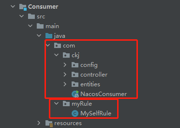

## 介绍

Spring Cloud Ribbon是一个基于HTTP和TCP的客户端负载均衡工具，它基于Netflix Ribbon实现。通过Spring Cloud的封装，可以让我们轻松地将面向服务的REST模版请求自动转换成客户端负载均衡的服务调用。Spring Cloud Ribbon虽然只是一个工具类框架，它不像服务注册中心、配置中心、API网关那样需要独立部署，但是它几乎存在于每一个Spring Cloud构建的微服务和基础设施中。因为微服务间的调用，API网关的请求转发等内容，实际上都是通过Ribbon来实现的，包括后续我们将要介绍的Feign，它也是基于Ribbon实现的工具。所以，对Spring Cloud Ribbon的理解和使用，对于我们使用Spring Cloud来构建微服务非常重要。

[ribbon github官网](https://github.com/Netflix/ribbon)

Ribbon是一个软负载均衡的客户端组件
可以和其他所需请求的客户端结合使用，和eureka结合只是其中一个实例
负载均衡+RestTemplate调用

## ribbon 能干什么

### LB负载均衡
 
Nginx是服务器负载均衡，所有请求都会交给nginx，再有nginx实现转发请求
Ribbon是本地负载均衡，在调用微服务接口的时候，会在注册中心上获取注册信息服务列表之后缓存到JVM本地，从而实现RPC远程服务调用技术

## RestTemplate使用

### getForObject方法/getForEntity方法

getForObject方法返回对象，基本上可以理解为json
getForEntity方法返回ResponseEntity对象，包含了响应中的一些重要信息，比如响应头、相应状态码、响应体等

### postForObject/postForEntity


### Get请求方法


### Post请求方法

## 负载规则替换

ribbon负载规则替换自定义配置类不能放在@ComponentScan所扫描的当钱包下以及子包下，也就是不能与主启动类在同一个包下



```java
package com.myRule;

import com.netflix.loadbalancer.IRule;
import com.netflix.loadbalancer.RandomRule;
import org.springframework.context.annotation.Bean;
import org.springframework.context.annotation.Configuration;

@Configuration
public class MySelfRule {
    @Bean
    public IRule myRule(){
        return new RandomRule();//自己选择新方式
    }
}
```

在主启动类上加入`@RibbonClient(name = "cloud-payment-service",configuration = MySelfRule.class)`