## 分布式事务
一次业务操作需要跨多个数据源或需要跨多个系统进行远程调用，就会产生分布式事务问题

## Seata介绍
是一款开源的分布式事务解决方案，致力于在微服务架构下提供高性能和简单易用的分布式事务服务
[Seata官网](http://seata.io/zh-cn/)

Seata是一个“1+3”的套件所组成，1就是全局唯一事务ID，只要在同一个事务ID下，就证明这是一套的，不管几个。3就是三大组件，主要是TC、TM、RM三个概念

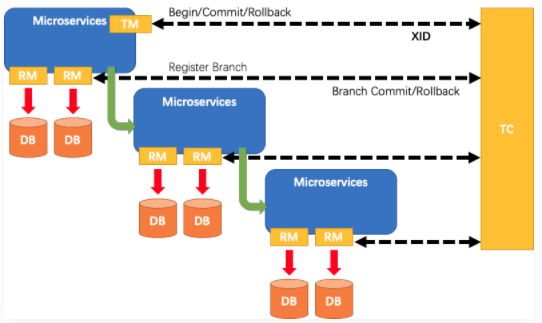

## Seata术语

- TC (Transaction Coordinator)
  事务协调者
  维护全局和分支事务的状态，驱动全局事务提交或回滚
- TM (Transaction Manager)
  事务管理器
  定义全局事务的范围：开始全局事务、提交或回滚全局事务
- RM (Resource Manager)
  资源管理器
  管理分支事务处理的资源，与TC交谈以注册分支事务和报告分支事务的状态，并驱动分支事务提交或回滚

## Seata处理过程

1. TM向TC申请开启一个全局事务，全局事务创建成功并生成一个全局唯一的XID
  老师生成班群号
2. XID在微服务调用链路的上下文中传播
  发布给班级所有人
3. RM向TC注册分支事务，将其纳入XID对应全局事务的管辖
  把所有学生纳入班级群统一管理
4. TM向TC发起针对XID的全局提交或回滚决议
  老师发起签到
5. TC调度XID下管辖的全部分支事务完成提交或回滚请求
  全部签到完成

## Seata

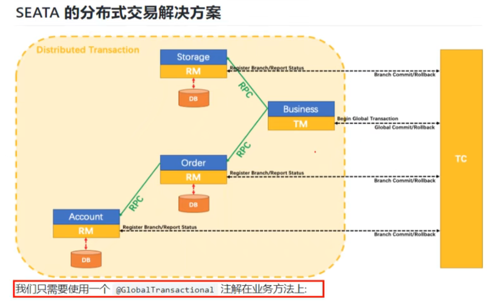

## 安装 && 配置

`sh nacos-config.sh -h localhost -p 8848 -g SEATA_GROUP -t 1f9c392c-6924-4ae8-8ea8-9e5a8ac047d8 -u nacos -w nacos`

1. store.redis.password= failure
2. store.redis.sentinel.sentinelHosts= failure
3. Set store.redis.sentinel.masterName= failure
4. Set store.publicKey= failure

### 安装

[seata-server下载](https://github.com/seata/seata/releases)

解压得到：
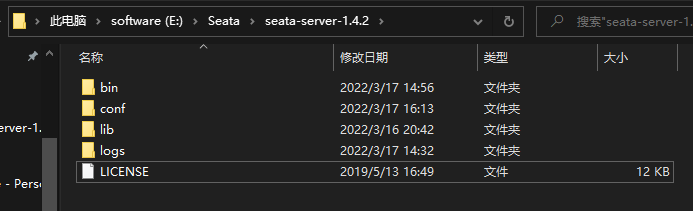

### 配置

#### 配置file.conf

进入`conf`目录，编辑`file.conf`

`file.conf`中是选择与编辑seata的存储运行方式，共三种：file、db、redis
- file
  默认
- db
  真正项目一般都用数据库的形式
- redis

本文采用`db`形式

将`mode = "file"`改为：`mode = "db"`

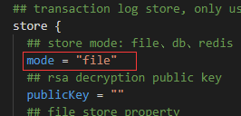

修改`db`参数，主要是：
- driverClassName
  `mysql 8.0`以后版本的，采用`com.mysql.cj.jdbc.Driver`
- url
  `mysql 8.0`以后版本的，注意时区
  注意到此处有连接到指定数据库，该处数据库本文命名为seata，在后文建立(数据库名可自定义)
- usr && password

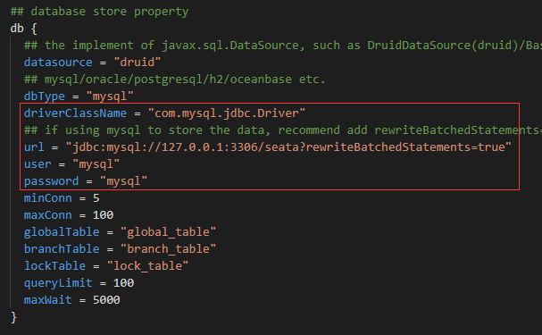

#### 配置registry.conf

- 进入`conf`目录，编辑`registry.conf`

`registry.conf`中配置的是服务注册平台与配置平台

本文选择`nacos`

将`registry`下的`type = "file"`改为`type = "nacos"`
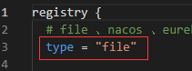

修改nacos下的配置内容：
- serverAddr
  nacos的url
- namespace
  先在nacos平台中新建一个专门存放seata的命名空间，复制其namespace
- username && password
  nacos的用户名密码
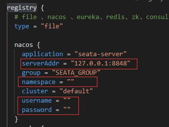

将`config`下的`type = "file"`改为`type = "nacos"`

本文选择`nacos`
修改`config`下的`nacos`的配置信息，与`registry`的`nacos`相同
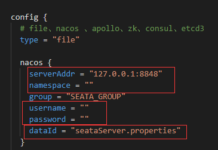

有一处不同，`config`下的`nacos`中，有`dataId`，这是服务注册没有的，这个指向`nacos`配置中心的配置文件(没有就新建)
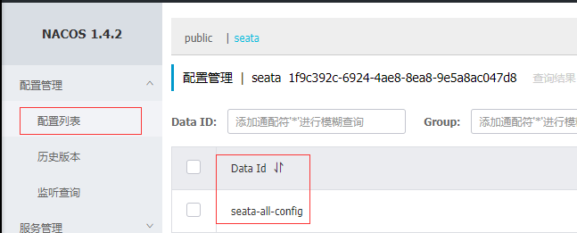

[config配置文件内容下载](https://github.com/seata/seata/tree/develop/script/config-center)

下载或复制其内容
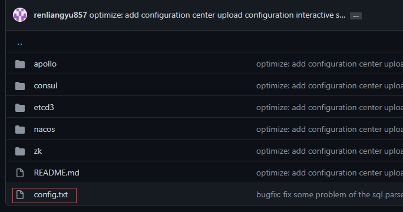

将内容复制到`nacos`配置列表中对应的配置文件(config.nacos.dataId指向的文件)

修改该配置文件内容
- db配置
  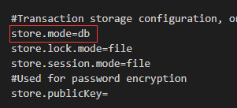
  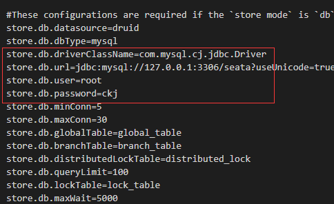
- vgroupMapping
  初学可不修改，该处为启动seata服务的服务
  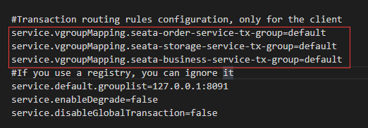

先运行nocas，再运行seata