## 介绍

面向云原生微服务的高可用流控防护组件，监控保护微服务

https://github.com/alibaba/sentinel

单独的一个组件，支持界面话的细粒度统一配置

## 下载

https://github.com/alibaba/sentinel/releases

下载某个版本的jar包

## 运行

进入下载下来的jar包文件夹内，启动cmd，`java -jar sentinel-dashboard-x.x.x.jar`

前提是8080端口未被占用

打开浏览器，进入http://localhost:8080

用户名和密码都是sentinel

## 服务注册进sentinel

### 依赖

```xml
<dependency>
    <groupId>com.alibaba.cloud</groupId>
    <artifactId>spring-cloud-starter-alibaba-sentinel</artifactId>
</dependency>

<dependency>
    <groupId>com.alibaba.csp</groupId>
    <artifactId>sentinel-datasource-nacos</artifactId>
</dependency>
```

### 配置文件

```yml
server:
  port: 8401
spring:
  application:
    name: sentinel-service
  profiles:
    active: dev

spring:
  cloud:
    sentinel:
      transport:
        dashboard: localhost:8080
        port: 8719 # 默认8719端口，假如被占用，会自动从8719开始依次+1扫描

management:
  endpoints:
    web:
      exposure:
        include: "*"
```

### 测试类

```java
package com.ckj.controller;

import lombok.extern.slf4j.Slf4j;
import org.springframework.web.bind.annotation.GetMapping;
import org.springframework.web.bind.annotation.RestController;

@RestController
@Slf4j
public class FlowLimitController {

    @GetMapping(value = "/testA")
    public String testA(){
        return "testA";
    }

    @GetMapping(value = "/testB")
    public String testB(){
        return "testB";
    }
}
```

### 测试

启动sentinel，启动测试服务

打开浏览器，登录http://localhost:8080 进入sentinel界面，发现没有service，因为阿里的sentinel采用的是懒加载，需要访问一遍服务才能加载的出来，新建窗口，加载 http://localhost:8401/testB 和 http://localhost:8401/testA 多加载几次，在sentinel的的实时监控中，发现二者的访问情况图


## sentinel功能

### 实时监控

服务注册进sentinel之后，就可在实时监控中查看到服务，但需要注意的是，sentinel采用的是懒加载，仅在访问服务后才能监控到

### 流控

sentinel流控规则
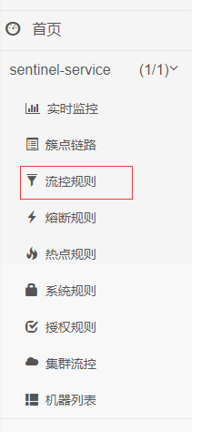

可在该板块添加流控规则

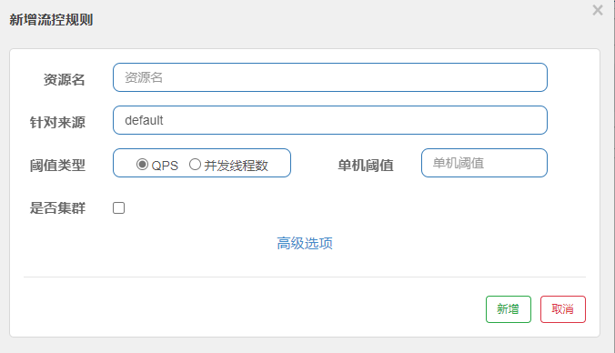

其中，资源名是指接口名，也就是

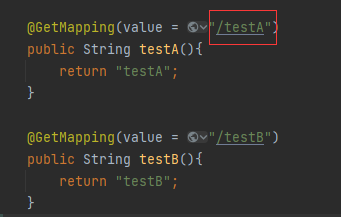

阈值类型：
  - QPS 每秒访问次数
  - 并发线程数

假如添加了如下规则：/testA QPS=1
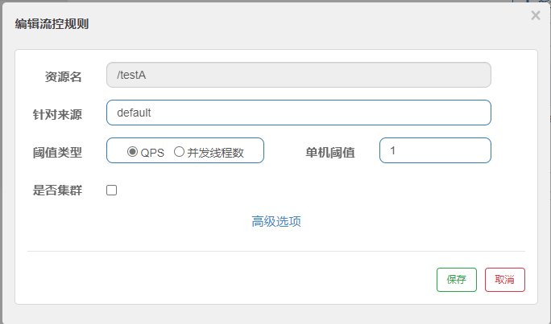

当访问`/testA`的频率超过每秒一次时，前端页面会返回限流提示
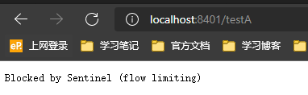

下列是高级选项的内容：
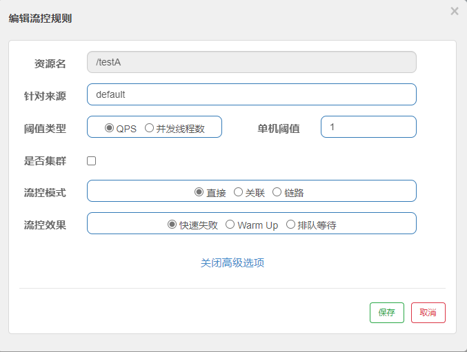

流控模式：
  - 直接
    出问题，直接被限流

  - 关联
    相关资源达到阈值，就限流自己
    比如A关联B资源，但B达到阈值了，于是A限流了
    B惹事，A挂了
    实际运用中，比如支付链接挂了，那么下订单的链接就会相应挂了
    设置关联时，会提示`关联资源`
    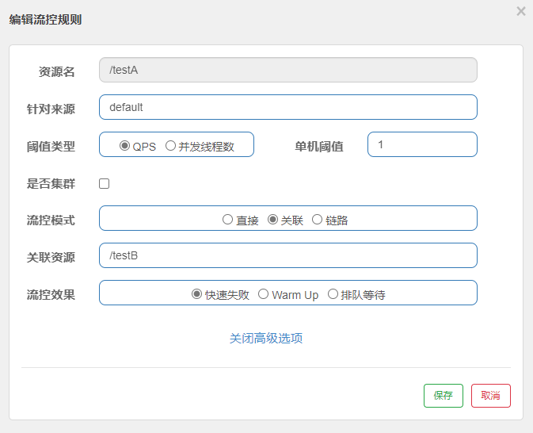
    上图代表着：`/testB`每秒访问次数超过1，则A无法访问了
    

  - 链路
    只针对从指定链路访问到本资源的请求做统计，判断是否超过阈值
    两条链路：
    - /testB -> /testA
    - /testC -> /testA
    如果只希望监控 /testC -> /testA 这条链路，不监控 /testB -> /testA，那么就像下图这样配置：
    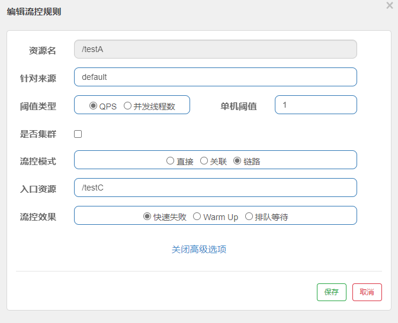

- 流控效果

  - 快速失败

  - 预热
    访问量一直为0，突然高访问量，此时会流控，需要预热一定时长之后承载能力才会达到阈值

    Warm Up：根据codeFactor 冷加载因子，默认值为3，请求QPS从`阈值/codeFactor`开始经过预热时长，才达到设置的QPS阈值

  - 排队等待
    让请求以均匀的速度通过，阈值类型必须设成QPS否则无效
    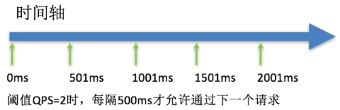

### 熔断降级
Sentinel熔断降级会在调用链路中某个资源出现不稳定状态时(例如调用超过或异常比例升高)，对这个资源的调用进行限制，让请求快速失败，避免影响到其它的资源而导致级联错误

当资源被降级后，在接下来的降级时间窗口内，对该资源的调用都自动熔断，默认行为时抛出DegradeException

Sentinel的断路器是没有半开状态的

- RT
  慢调用比例
  平均响应时间超出阈值 且 在时间窗口内通过的请求>=5，两个条件同时满足后触发降级
  窗口期过后关闭断路器
  RT最大4900，更大可需通过Dcsp.sentinel.statistic.max.rt=XXXX来设置

- 异常比例-秒级
  QPS >= 5 且异常比例(秒级统计)超过阈值时，触发降级，时间窗口结束后，关闭降级

- 异常数-分钟级
  异常数(分钟统计)超过阈值时，触发降级；时间窗口结束后，关闭降级

### 热点

判断参数的请求量，如果超过阈值，则被限流

热点关注的是参数，流控规则关注的是整个方法

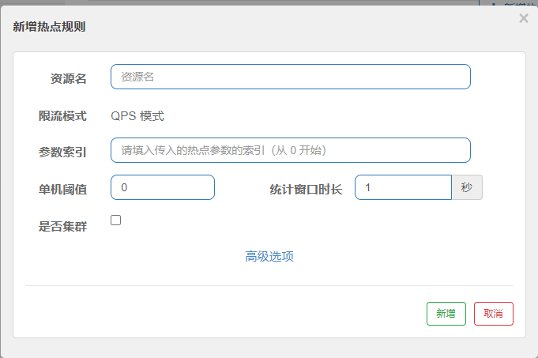

#### 参数例外项

可理解为vip设置

关注的参数按照原来的规则进行限流，但关注的参数达到某种条件，则变为新的限流规则

下图表示：平时，参数索引为0的参数阈值为1，超过1就限流，但如果该参数的值为5，则限流阈值变为200

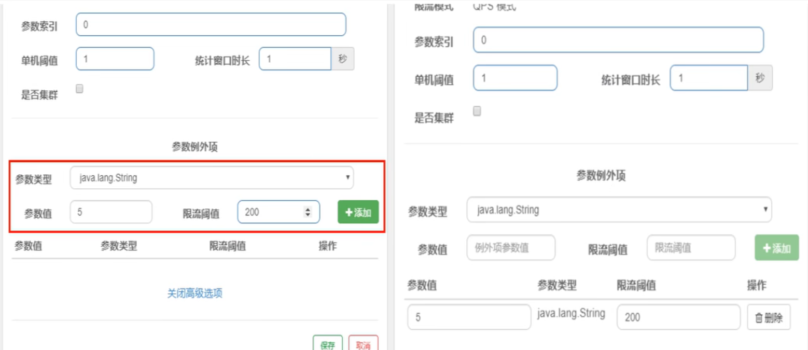

### 系统规则

系统整体的规则

### @SentinelResource

处理的Sentinel控制台配置的违规情况，java运行时报的异常错，@SentinelResource不管

@SentinelResource注解最主要的两个用法：限流控制和熔断降级的具体使用。另外，该注解还有一些其他更精细化的配置，如忽略某些异常的配置，默认降级函数等等。

@SentinelResource属性介绍：
- Value：资源名称，必需项（不能为空）。
- entryType：entry类型，标记流量的方向，取值IN/OUT，可选项（默认为EntryType.OUT）
- blockHandler：处理BlockException的函数名称（可以理解对Sentinel的配置进行方法兜底）。函数要求：
  - 必须是public修饰
  - 返回类型与原方法一致
  - 参数类型需要和原方法相匹配，并在最后加BlockException类型的参数。
  - 默认需和原方法在同一个类中，若希望使用其他类的函数，可配blockHandlerClass，并指定blockHandlerClass里面的方法。
- blockHandlerClass：存放blockHandler的类。对应的处理函数必须是public static修饰，否则无法解析，其他要求：同blockerHandler。
- fallback：用于在抛出异常的时候提供fallback处理逻辑（可以理解为对java异常情况方法兜底）。fallback函数可以针对所有类型的异常（除了exceptionsToIgnore里面排除掉的异常类型）进行处理。函数要求：
  - 返回类型与原方法一致
  - 参数类型需要和原方法相匹配，Sentinel 1.6开始，也可以在方法最后加Throwable类型的参数。
  - 默认需和原方法在同一个类中。若希望使用其他类的函数，可配置fallbackClass，并制定fallbackClass里面的方法。
- fallbackClass：存放fallback的类。对应的处理函数必须static修饰，否则无法解析，其他要求：同fallback。
- defaultFallback：用于通用的fallback逻辑。默认fallback函数可以针对所有类型的异常（除了exceptionsToIgnore里面排除掉的异常类型）进行处理。若同时配置了fallback和defaultFallback，以fallback为准。函数要求：
  - 返回类型与原方法一致。
  - 方法参数列表为空，或者有一个Throwable类型的参数。
  - 默认需要和原方法在同一个类中。若希望使用其他类的函数，可配置fallbackClass，并指定fallbackClass里面的方法。
- exceptionsToIgnore：指定排除掉哪些异常。排除的异常不会计入异常统计，也不会进入fallback逻辑，而是原样抛出。
- exceptionsToTrace：需要trace的异常

常用：`@SentinelResource(value="方法1",blockHandler="方法2")`
若方法1被限流了，则执行方法2，若无blockHandler，用sentinel自带的

```java
// 限流与阻塞处理
@SentinelResource(value = "doSomeThing", blockHandler = "exceptionHandler")
public void doSomeThing(String str) {
    log.info(str);
}

public void exceptionHandler(String str, BlockException ex) {
    log.error("blockHandler：" + str, ex);
}
```

### 自定义限流处理逻辑

利用`@SentinelResource`注解实现自定义逻辑，核心利用到以下三个参数
- value
- blockHandlerClass
- blockHandler

步骤：
- 编写自定义限流处理
  ```java
  package com.ckj.myHandler;

  import com.alibaba.csp.sentinel.slots.block.BlockException;
  import com.ckj.entities.CommonResult;

  public class CustomerBlockHandler {
      public static CommonResult handlerException(BlockException exception){
          return new CommonResult(4444,"自定义global handlerException-----1");
      }

      public static CommonResult handlerException2(BlockException exception){
          return new CommonResult(4444,"自定义global handlerException-----2");
      }
  }
  ```

  其中`CommonResult`是自定义的返回类
  ```java
  package com.ckj.entities;

  public class CommonResult<T> {
      private Integer code;
      private String message;
      private T data;
      // get && set && toString && constructor
  }

  ```

- 编写`controller`
  ```java
    @GetMapping(value = "/testD")
    public CommonResult testD() {
        return new CommonResult(200, "自定义内容");
    }
  ```

- 添加`@SentinelResource`注解
  ```java
  @SentinelResource(value = "testD",
        blockHandlerClass = CustomerBlockHandler.class,
        blockHandler = "handlerException2")
  ```
  - value指明哪一个controller使用该注解
  - blockHandlerClass指明所使用的自定义处理方法的类
  - blockHandler指明使用类中的哪一个方法

需要注意的是
- blockHandler的函数要求：
  - 必须是public修饰
  - 返回类型与原方法一致
  - 参数类型需要和原方法相匹配，并在最后加BlockException类型的参数。
  - 默认需和原方法在同一个类中，若希望使用其他类的函数，可配blockHandlerClass，并指定blockHandlerClass里面的方法

所以`testD`的返回类型是`CommonResult`

### 异常处理

blockHandler处理Sentinel异常，也就是sentinel中设置的限流规则
fallback处理java运行时异常
二者可同时配置

二者代码类似，仅注解中的参数不同，blockHandler参考上方代码，fallback参考下方代码

```java
package com.ckj.controller;

import com.alibaba.csp.sentinel.annotation.SentinelResource;
import com.ckj.entities.CommonResult;
import lombok.extern.slf4j.Slf4j;
import org.springframework.beans.factory.annotation.Value;
import org.springframework.web.bind.annotation.PathVariable;
import org.springframework.web.bind.annotation.RequestMapping;
import org.springframework.web.bind.annotation.RestController;
import org.springframework.web.client.RestTemplate;

import javax.annotation.Resource;

@RestController
@Slf4j
public class OrderNacosController {
    @Value("${service-url.nacos-user-service}")
    private String serviceUrl;

    @Resource
    private RestTemplate restTemplate;

    @RequestMapping("/consumer/fallback/{id}")
    @SentinelResource(value = "fallback", fallback = "handlerFallback") //fallback 只负责业务异常
    public CommonResult fallback(@PathVariable Long id) {
        CommonResult result = restTemplate.getForObject(serviceUrl + "/getPaymentAndPort/" + id, CommonResult.class, id);

        if (id == 4) {
            throw new IllegalArgumentException("IllegalArgumentException，非法参数异常……");
        } else if (result.getData() == null) {
            throw new NullPointerException("NullPointerException，该ID没有对应记录，空指针异常");
        }
        return result;
    }

    public CommonResult handlerFallback(@PathVariable Long id, Throwable e) {
        Payment payment = new Payment(id, "null");
        return new CommonResult(444, "兜底异常handlerFallback,exception内容" + e.getMessage(), payment);
    }
}
```

